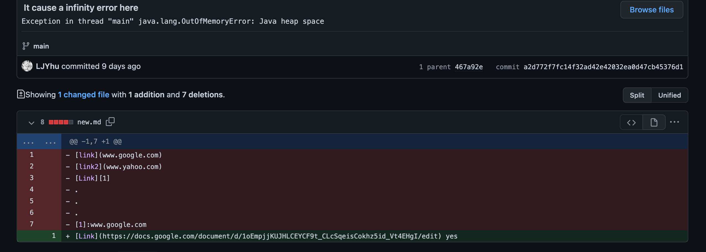

# The first change

> This is the first version we upload in order to solve the infinity loop


> This is the page of the test file which inspire us to do so
> This is the [Link](https://github.com/LJYhu/markdown-parser/blob/main/new.md)


> The Symptom


# The second change

> This is the second version we upload in order to solve the 
> case that we do not have Paren in the test file


> This is the page of the test file which inspire us to do so
> This is the [Link](https://github.com/LJYhu/markdown-parser/blob/main/haveBracket.md)


> The Symptom


# The third change

> This is the third version we upload in order to solve the double print problem
> which we have not noticed before


> The test page is [Link](https://github.com/LJYhu/markdown-parser/blob/main/new.md)


> The Symptom


```
The Bug will cause the Symptom as the bug will make the code to run in the wrong way and result in the error or the wrong out put.
While the the failure-inducing input will help the programmer to find the Symptom and then find the bug,
which means it can help programmers to fix the code.
```
