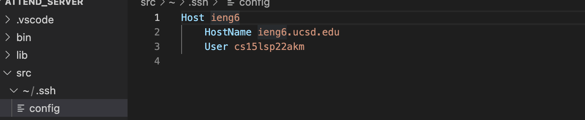
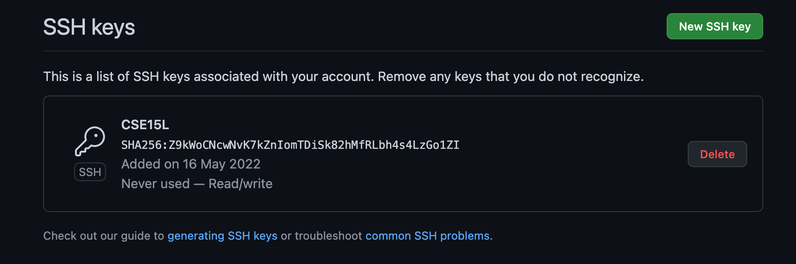
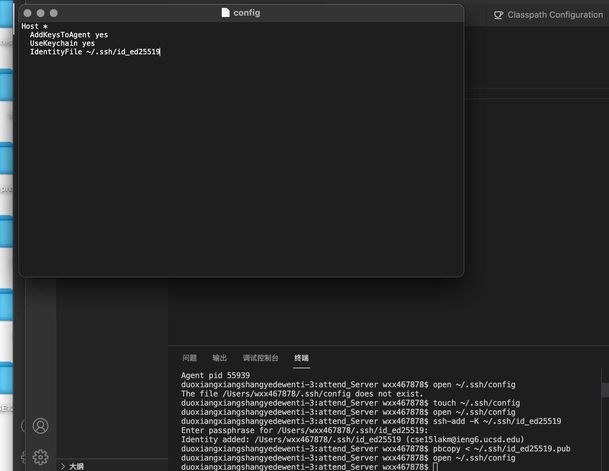
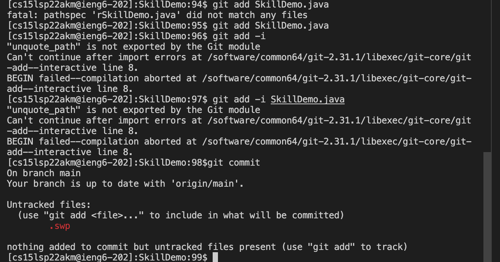
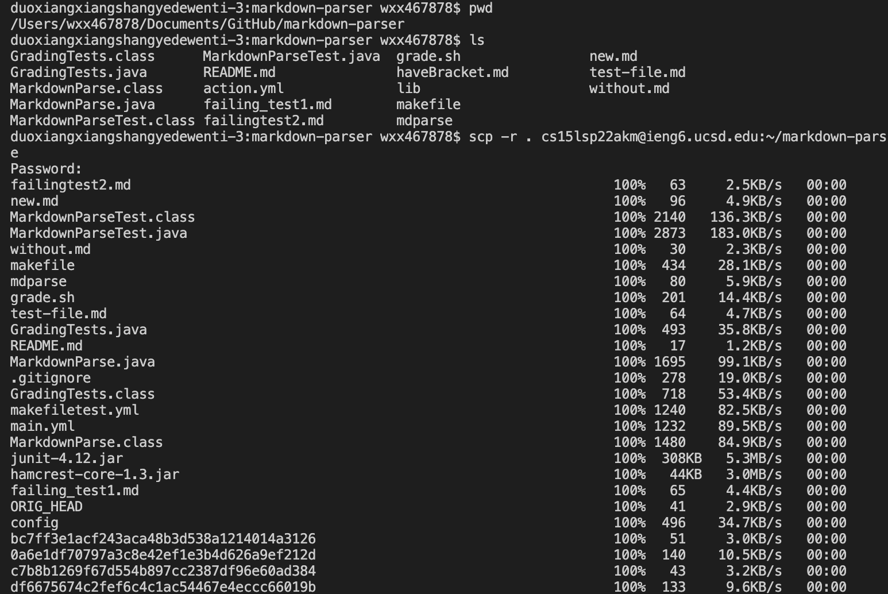
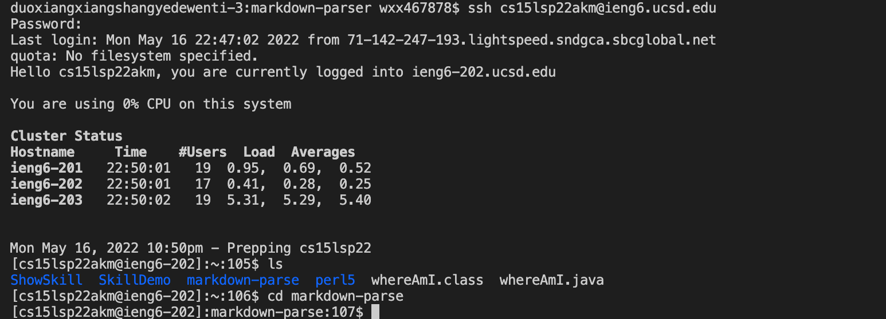

# Streamlining ssh Configuration

This is how I edit the file to try to set the key.

But when I try to enter the server, it always show the connection problem. In case I can log in my account successfully, I do not know what is wrong with it.

# Setup Github Access from ieng6

This is the screenshot of the public key I set to the github

This is the key on my computer. I don't whether it is the right screenshot to show that.

But I met a problem when I try to commit the change to the repo. So, I can not provide my link of the commit change.

# Copy whole directories with scp -r

I am confused about how to do the last task.