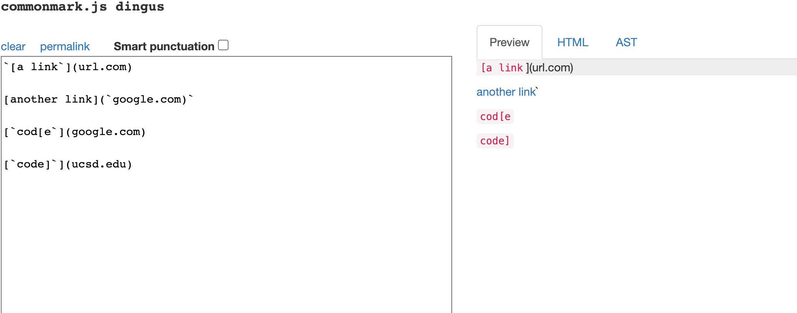

# The Link of My repo
[Link](https://github.com/LJYhu/markdown-parser)
# The Link of The repo I reviewed
[Link](https://github.com/Pgerardocastaneda/markdown-parser)

# The expected value

The expected output of Snnipet 1


The expected output of Snnipet 2


The expected output of Snnipet 3


# The code in the test file

Snnipet 1


Snnipet 2


Snnipet 3


# The test result of my implementation

Result of Snnipet 1


Result of Snnipet 2


Result of Snnipet 3


All three tests failed.

# The test result of the reviewed one
Result of All Three


All three tests failed.

# Anwser The Question

```
Do you think there is a small (<10 lines) code change that will make your program work for snippet 1 and all related cases that use inline code with backticks? If yes, describe the code change. If not, describe why it would be a more involved change.
```
For the first Snippet, I think we can get the index of "\`". After we go through one link, which is one loop, we canuse indexOf("\`", currentIndex) to get the index of "\`" in this subtring, check whether the subtring from currentIndex to openParen contains "\`". Also we need to check whether the "\`"'s index occured before the first bracket.

```
Do you think there is a small (<10 lines) code change that will make your program work for snippet 2 and all related cases that nest parentheses, brackets, and escaped brackets? If yes, describe the code change. If not, describe why it would be a more involved change.
```
We can check whether we have both "\("and "\)" in the bracket. If so, return the link in the "\()" and directly go to next loop.
```
Do you think there is a small (<10 lines) code change that will make your program work for snippet 3 and all related cases that have newlines in brackets and parentheses? If yes, describe the code change. If not, describe why it would be a more involved change.
```
In this case, I think we can check the "\n" in every substring. If the nnumber of "\n" is greater and equal than 2, then we can directly go to the next loop.
