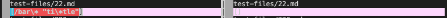
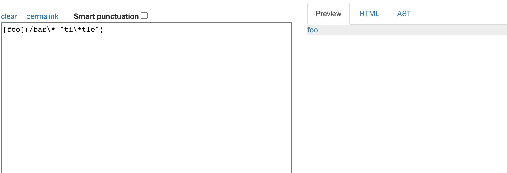
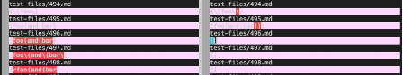
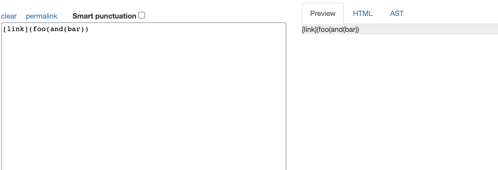

# How you found the tests with different results
I found the different results by using vimdiff. 

# Test 1

Link of the test: [test-files 22](https://github.com/nidhidhamnani/markdown-parser/blob/main/test-files/22.md)

Which is correct:
Mine is correct, since this is a link, so the output should have the link

Actual output:

Expected output:

Describe the Bug: This bug appears as the wrong one detected that there are one " " in the content. 
In this case, the method thinks this is not a link.

# Test 2

Link of the test: [test-files 496](https://github.com/nidhidhamnani/markdown-parser/blob/main/test-files/496.md)

Which is correct:
The provided one is correct, since this is not a valid Link, so it should not have any output

Actual output:

The test-file/496.md one.

Expected output:

Describe the Bug: This bug appears as the wrong one detected the "\(" and "\)". 
When the program go through one loop and detected the"()", it add the content in "()" to the ArrayList.
