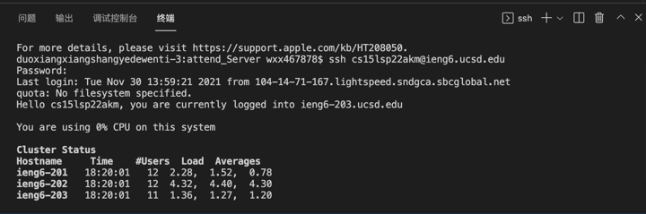
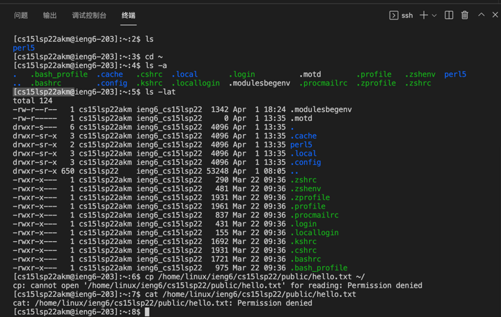
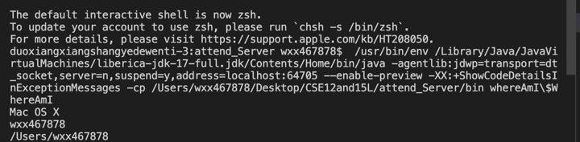
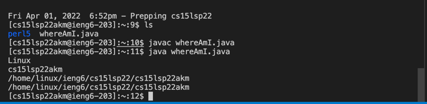
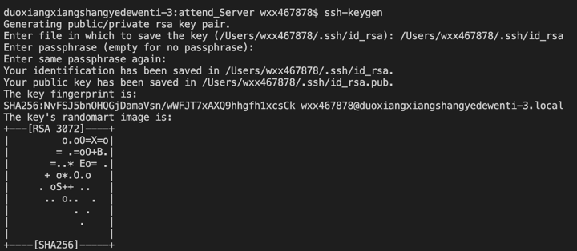
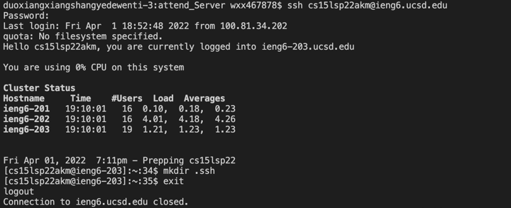
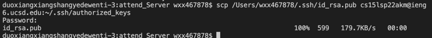
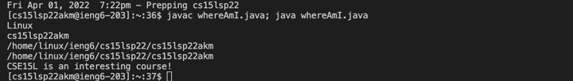

# Installing VScode


```
I have downloaded the VScode when I take the CSE8B. I downloaded on it's official website.
```


# Remotely Connecting




```
The password will not be shown by terminal due to the security.
The time and the Users Load and Averages are different since the different time we login.
```


# Trying Some Commands




```
I have tried these command and I have noticed that the ls -lat is the combination of ls -a and ls, 
as we can check the blue and green name and find out that they are the same but displayed in a detailed way in the ls -lat.
```


# Moving Files with scp





```
When I run this code on my computer, it shows I’m at Mac OS X. When I run this code in the ssh, 
it shows I’m at Linux. I think the getProperty can get some basic information  such as the type and name of the device.
This time I spent almost minutes as I made some mistake at first. But if I do it so many times, 
I believe the time can be shortened in a minute even less.
```


# Setting an SSH Key






```
I use the SSH key to paraphrase my passcode.
Since we don’t have to enter our password everytime now, I think the time we spend will be shorter, and I used 20 sec to finish it.
```


# Optimizing Remote Running




```
I have tried multiple times to save and run this file within 4 seconds, 
but entering the “ssh username@ieng.ucsd.edu” takes me a  lot of time. 
After using all the command I need to use in the terminal, 
I can just use my uparrow to get this command, and this makes the time shorter. 
I haven’t count my keystrokes precisely. But during the shortest try, I used around 11 keystrokes.
```

